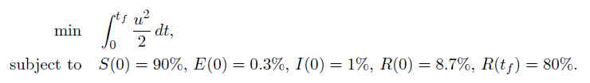
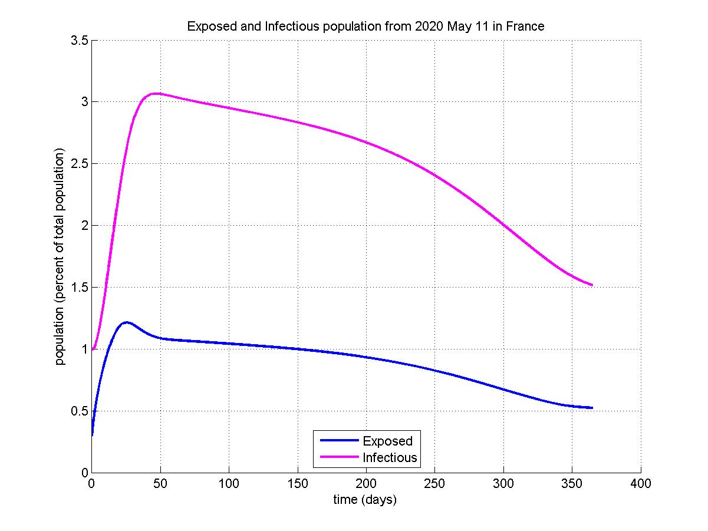
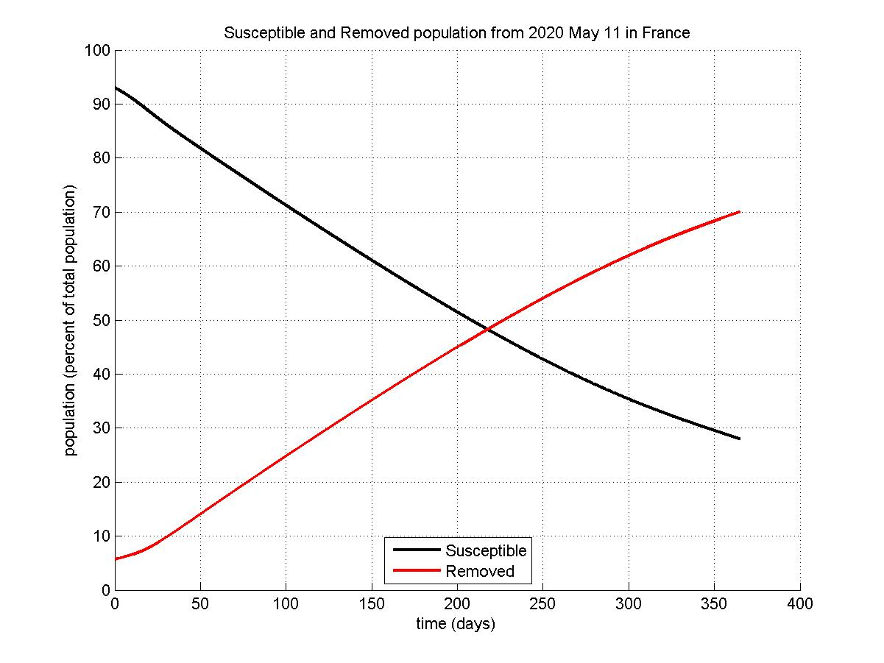
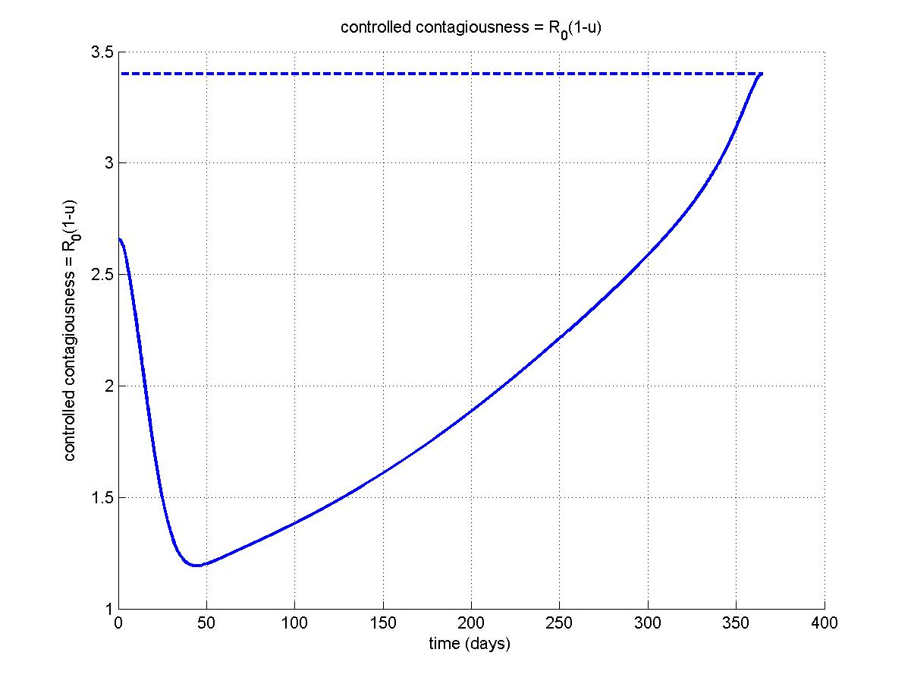

COVID-19
===========

Files
----------
+ covid-19 model is in src/models/covid19
+ main program is in tests/testCovid19.cpp
+ results are in trace/covid19

Objective
----------
Using a SEIR model for the covid-19 epidemic, the problem considered here is the following:
+ Control lockdown with minimum effort (in a quadratic way). This is motivated by the fact that lockdown effort has a great impact on economy.
+ One year after end of full lockdown (on May 11, 2020, in France), the total removed (recovered + isolated + fatalities) population achieves 80% (which corresponds approximatively to natural herd immunity).

SEIR model and control problem
----------
Simulation of a SEIR model is possible on the [epidemic calculator](https://gabgoh.github.io/COVID/index.html). Equations are recalled here, where the variable 'u' is introduced as a continuous lockdown control (no lockdown if u=0):

The optimal control problem is the following:

Parameters
----------
COVID-19 model:
+ R0 = 4
+ Tinf = 10 days
+ Tinc = 5 days

Epidemic state on May 11, 2020, in France:
+ Susceptible: 90%
+ Exposed: 0.3%
+ Infectious: 1%
+ Removed: 8.7%

Desired epidemic state on May 10, 2021:
+ Removed : 80%

Results
----------
Results are presented in the Figures below. Even for this "worst case" scenario (80% herd immunity will induce many fatalities), results confirm that end of lockdown should be very progressive to restrain the number of infections actively circulating along the year.
However, the total infected population remains under 3%.

Remarks
----------
Note that initial covid-19 parameters should be refined.

Future work: control the reproduction number to minimize lockdown effort while constraining the number of infected people.
